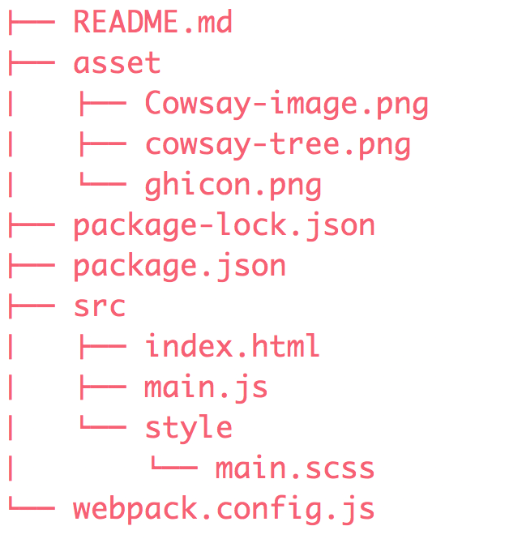

# Code Fellows: Seattle 401 JavaScript - 401d19

## Lab 26: Cowsay

### Author: 
Catherine Looper

### Motivation

In this project, I built a frontend application containing a `'click me'` button that generates random cow speak on each click using cowsay and faker. In this application, I configured webpack to compile JavaScript and SASS into a bundle and configured babel to transpile JSX and ES6 to ES5 JavaScript. I was able to create and render React components to the DOM, add event listeners to React components, and update React component state.

Additionally, this application has a dropdown menu that allows users to select from the following animals: cow, turtle, stegosaurus, whale or squirrel. The selected animal will be displayed to the page along with a random cowsay message. You can view the stegosaurus selection below: 

### Build

### Limitations

To use this app - it is assumed that the user has familiarity with the tech and frameworks listed below.

### Code Style

Standard JavaScript with ES6, SASS, CSS, HTML

### Tech/Framework Used

* babel-core
* babel-loader
* babel-plugin-transform-object-rest-spread
* babel-preset-es2015
* babel-preset-react
* cowsay-browser
* css-loader
* eslint-plugin-react
* extract-text-webpack-plugin
* faker
* html-webpack-plugin
* node-sass
* react
* react-dom
* resolve-url-loader
* sass-loader
* webpack
* webpack-dev-server
* eslint

### How to use?

* Step 1. Fork and Clone the Repository.
* Step 2. `npm install`
* Step 3. `npm run watch`
* Step 4. You should now be able to visit: `http://localhost:8080/` to view the application
* Step 5. Click the button that says `'click me'` to see the cow speak or use the dropdown menu to view a different animal!

### Credits

* Code Fellows

### License

MIT © Catherine Looper

